# A1：初试环境和工具

## 1. 环境概览
**os：**  
Ubuntu 22.04.4 LTS（Jammy Jellyfish），Linux 内核版本为 6.8.0-124-generic

**CPU：**  
 Intel Core Ultra 5 125H，在虚拟机中可见 2 个逻辑处理器
 
 **内存：**  
 物理内存约 3.8 GiB（VMware 分配 4 GB），采样时已用 1.4 GiB、可用 2.2 GiB，交换空间约 2.1 GiB。


## 2. 常用工具命令操作练习

### (1) `uname -a`

#### a. 分析输出结果包含了哪些信息

输出结果：

```bash
yjh@yjh-10245501460:~/SE/A1$ uname -a
Linux yjh-10245501460 6.8.0-124-generic #124~22.04.1-Ubuntu SMP PREEMPT_DYNAMIC Tue May 26 21:05:19 UTC  x86_64 x86_64 x86_64 GNU/Linux
```

里面包含的信息分别为：内核名称、主机名、内核发行版本、内核构建信息（构建编号、SMP 多处理器支持、动态抢占和构建时间）、机器硬件名称、处理器类型、硬件平台，以及操作系统标识 GNU/Linux。输出中的三个 x86_64 分别对应机器硬件名称、处理器类型和硬件平台。
#### b. Linux 内核版本与指令集架构是什么？

Linux 内核版本：6.8.0-124-generic。  
指令集架构：x86_64（即 64 位 x86 架构，也称 AMD64）。

### (2) `cat /etc/os-release`

#### a. 分析输出结果包含了哪些信息
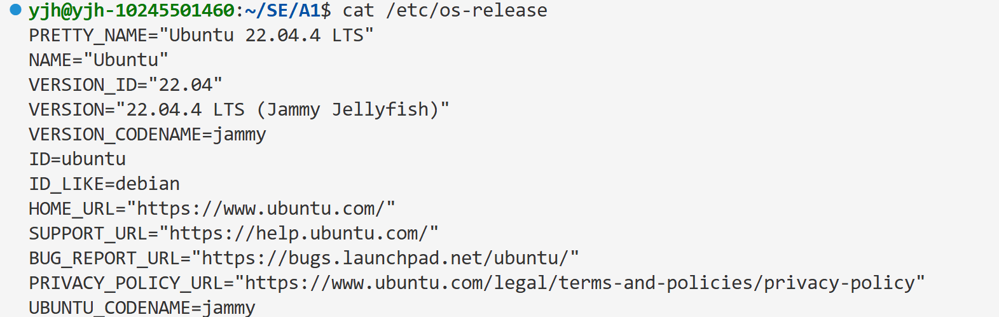
里面包含的信息为：发行版名称 NAME、完整名称 PRETTY_NAME、版本号 VERSION_ID、版本描述 VERSION、版本代号 VERSION_CODENAME、发行版标识 ID、相关发行版 ID_LIKE，以及官方主页、支持页面、Bug 提交地址、隐私政策地址和 Ubuntu 专用代号字段

### (3) `sysctl -a`
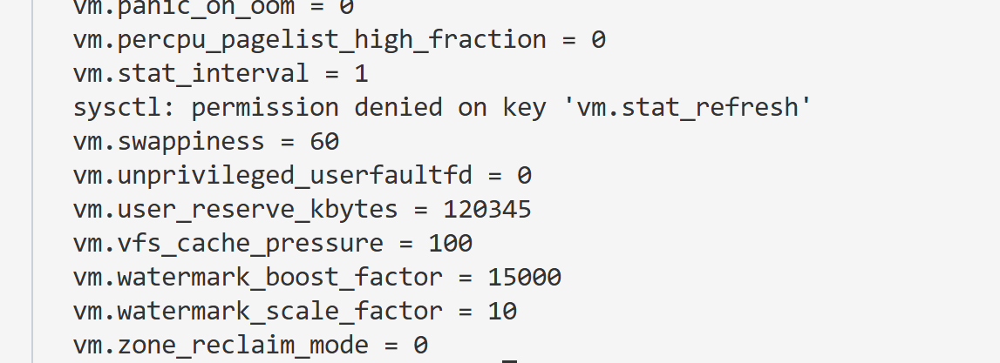
#### a. 该命令的功能是什么？-a选项的含义是什么？

主要功能：在运行时查看和修改内核参数。  
-a 是 --all 的缩写，表示显示当前可用的内核参数及其值，通常以“参数名 = 值”的形式输出
#### b. 输出结果与目录 /proc/sys 的关系是什么？
/proc/sys 是内核通过 procfs 提供的参数接口，里面是虚拟文件。sysctl 读取这些接口，并把路径转换为点分隔的参数名，例如 /proc/sys/kernel/osrelease 对应 kernel.osrelease。修改参数通常需要管理员权限。
#### c. 比较 kernel.ostype 和 kernel.osrelease 与 (1)(2)命令的输出，他们是一致的吗？

验证命令及输出结果：

```bash
yjh@yjh-10245501460:~/SE/A1$ sysctl kernel.ostype
kernel.ostype = Linux
yjh@yjh-10245501460:~/SE/A1$ sysctl kernel.osrelease
kernel.osrelease = 6.8.0-124-generic
```

`sysctl kernel.osrelease`与`uname -a` 中的内核名称和内核版本一致。  
`cat /etc/os-release`显示的是**Ubuntu**发行版信息，`sysctl kernel.ostype`显示的是操作系统，但是本质上是一样的。
#### d. 任选2个 kernel.perf_* 或 kernel.sched_* 参数，解释其含义

验证命令及输出结果：
```bash
$ sysctl kernel.perf_event_paranoid kernel.perf_event_max_sample_rate
kernel.perf_event_paranoid = 4
kernel.perf_event_max_sample_rate = 100000
```

`kernel.perf_event_paranoid：`限制非特权用户使用性能监控事件的权限，数值越高通常限制越严格。在这里 Ubuntu 的值为 4，虚拟机用户的 perf_event_open 使用受到严格限制；  
`kernel.perf_event_max_sample_rate：`限制 perf 采样事件的最高频率，本机为每秒 100000 次，用于控制性能采样的开销上限  。

### (4) `lscpu`

#### a. 处理器型号、物理核、硬件线程、频率和各级缓存分别是什么？   
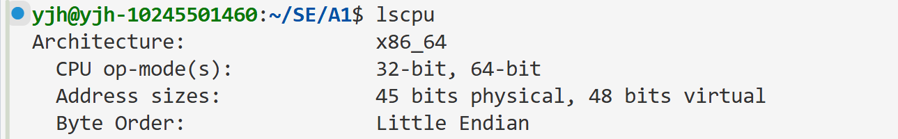
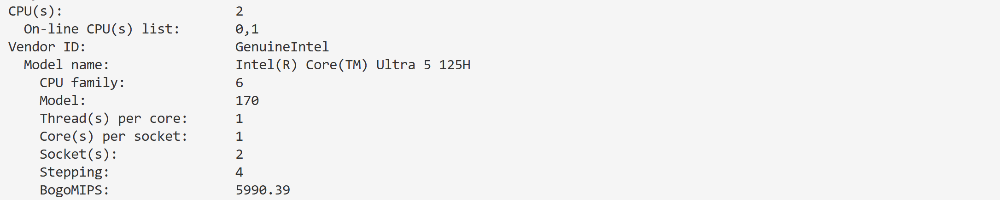
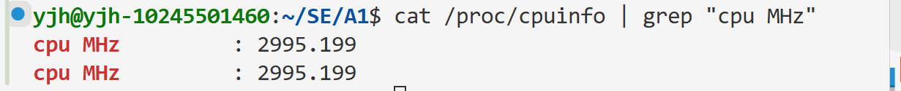
处理器型号为 Intel(R) Core(TM) Ultra 5 125H。虚拟机显示 2 个插槽，每个插槽 1 个核心，每核 1 个线程，因此虚拟机可见 2 个核心、2 个逻辑处理器，没有显示 SMT 多线程。  
本机 lscpu 没有 CPU 基准、最大、最小频率字段，经过查阅之后发现，`/sys/devices/system/cpu/cpu0` 下也没有提供 cpufreq 频率接口，因此无法从本次虚拟机环境获得这三个频率。`/proc/cpuinfo` 中两颗虚拟 CPU 的 cpu MHz 都为 2995.199 MHz，约 3.0 GHz。  
缓存大小分别为：L1 数据缓存总计 96 KiB（2 个实例，每个 48 KiB）；L1 指令缓存总计 128 KiB（2 个实例，每个 64 KiB）；L2 总计 4 MiB（2 个实例，每个 2 MiB）；L3 总计 36 MiB（2 个实例，每个 18 MiB）。
#### b. 处理器是大端序还是小端序？列举另一种端序的应用场景

本机 Byte Order 为 Little Endian，即小端序，多字节数据的低位字节存放在低地址。  
大端序的应用场景：TCP/IP 网络协议的多字节字段使用网络字节序，例如端口号。
#### c. Address sizes 中 physical 和 virtual 分别代表什么？64 位机器的两者也是64位吗？

physical 表示 CPU 支持的物理地址宽度，virtual 表示虚拟地址宽度。本机分别为 45 bits physical 和 48 bits virtual，并不是 64 位。  
64 位架构不要求地址总线和有效虚拟地址位数也全部实现为 64 位。为了降低硬件和页表管理成本，处理器通常只实现当前需要的地址范围；本机理论物理寻址范围为 2^45 字节，即 32 TiB，48 位虚拟地址空间为 2^48 字节，即 256 TiB。它们表示寻址能力，不等于实际安装的内存大小；x86_64 的虚拟地址还需满足规范地址的高位扩展规则。

### (5) `dmidecode`

#### a. 该命令的功能是什么？

dmidecode 用来读取并解码 BIOS/UEFI 提供的 DMI/SMBIOS 硬件信息表，可以查看系统、主板、BIOS、处理器、内存和插槽等信息。它主要读取固件提供的描述，不是实时性能监控工具；这些描述也可能不完整。读取硬件表通常需要 sudo 权限。  
本次执行 `sudo dmidecode -t memory`，-t memory 表示只查看内存相关类型。
#### b. 以内存为例，可以获得哪些信息？
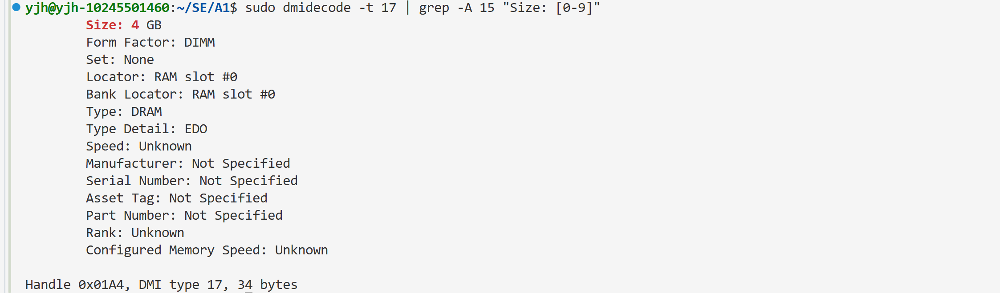
可以获得内存阵列所在位置、用途、最大支持容量、设备数量、纠错类型，以及各内存设备的容量、插槽位置、类型、外形、总位宽和数据位宽、速度、配置速度、厂商、序列号、部件编号和 Rank 等信息。  
在这里，RAM slot #0 显示 Size 为 4 GB、Form Factor 为 DIMM、Type 为 DRAM、Total Width 和 Data Width 都为 32 bits；其所在内存阵列的 Error Correction Type 为 None，其他 RAM 插槽显示 No Module Installed。Speed 和 Configured Memory Speed 为 Unknown，由于是虚拟的盘，厂商、序列号等为 Not Specified。

### (6) `numactl -H`

#### a. 该命令的功能是什么？-H选项的含义是什么？

numactl 用于设置进程的 CPU 节点绑定、逻辑 CPU 绑定和 NUMA 内存分配策略，也可以查询相关信息。-H 是 --hardware 的缩写，表示显示 NUMA 硬件布局，包括节点数、各节点的 CPU、内存容量、空闲内存和节点距离。
输出结果：

```bash
$ numactl -H
available: 1 nodes (0)
node 0 cpus: 0 1
node 0 size: 3868 MB
node 0 free: 941 MB
node distances:
node   0
  0:  10
```

#### b. NUMA 节点数量有多少个？

本机有 1 个 NUMA 节点，编号为 0；包含 CPU 0、CPU 1，内存约 3868 MB。这里 numactl 显示的 MB 按 1024² 字节换算。
#### c. node distances 的含义是什么？列举可能受其影响的应用场景

node distances 是节点之间内存访问相对代价的矩阵，由固件或内核提供，通常本节点的距离为 10，较大的数值表示相对访问代价较高。它不是直接测量的纳秒延迟，也不能把距离数值简单当作精确的延迟倍数。  
本机只有节点 0，矩阵中仅有 0 到 0 的距离 10，无法观察跨节点访问差异。多节点机器中，数据库缓冲池、大矩阵运算、科学计算和网络服务的工作线程，都可能因访问远端节点内存而增加延迟、占用节点间互连带宽；合理绑定线程和分配本地内存有助于改善性能。
#### d. 执行`numactl --show`，说明作用、输出分析及与 -H 的区别

输出结果：

```text
$ numactl --show
policy: default
preferred node: current
physcpubind: 0 1
cpubind: 0
nodebind: 0
membind: 0
```

该指令显示当前进程的 NUMA 策略和绑定范围。  
policy: default 表示默认内存分配策略，通常优先从执行线程所在节点分配；preferred node: current 表示当前节点，没有指定一个固定的优先节点。physcpubind: 0 1 表示可运行的逻辑 CPU 编号为 0 和 1，这里的“physical CPU”是 numactl 的命名，不等于宿主机物理核心。cpubind: 0、nodebind: 0 表示 CPU 绑定涉及节点 0；membind: 0 表示可用的内存节点为 0，并不表示 policy 已设置为严格 membind。  
numactl --show 查询的是当前进程的策略和允许范围；numactl -H 查询的是系统的 NUMA 硬件布局及节点间距离。

### (7) `free -h`

#### a. 分析输出结果，解释两行数据的含义

输出结果：

```bash
$ free -h
               total        used        free      shared  buff/cache   available
Mem:           3.8Gi       1.4Gi       941Mi        13Mi       1.5Gi       2.1Gi
Swap:          2.1Gi          0B       2.1Gi
```

-h 表示以方便人阅读的单位显示容量。  
Mem 行表示物理内存：total 为系统可用的物理内存总量；used 为已使用的内存；free 为完全未使用的内存；shared 主要是 tmpfs 等共享内存；buff/cache 为缓冲区和缓存；available 为估计无需交换就可供新程序使用的内存，包含可回收的部分缓存，因此通常大于 free。shared 不是应再单独加到 total 中的一项。  
本次采样物理内存约 3.8 GiB，已用 1.4 GiB，完全空闲约 941 MiB，缓冲和缓存约 1.5 GiB，可用约 2.1 GiB；大量缓存不意味着这些内存都无法再利用。  
Swap 行表示交换空间：总量约 2.1 GiB，已用 0 B，空闲约 2.1 GiB。交换空间通常由磁盘提供，不是额外的物理内存。
#### b. GiB 和 GB两种单位的区别是什么？

GiB 使用二进制计量，1 GiB = 2³⁰ B = 1073741824 字节；GB 使用十进制计量，1 GB = 10⁹ B = 1000000000 字节。  
因此 1 GiB 约等于 1.074 GB，4 GB 约等于 3.725 GiB。VMware 设置界面的 GB 标签常用于表示按二进制换算的分配容量，系统还会保留部分内存

### (8) `ps -aux`

#### a. 分析输出结果，解释每列数据的含义
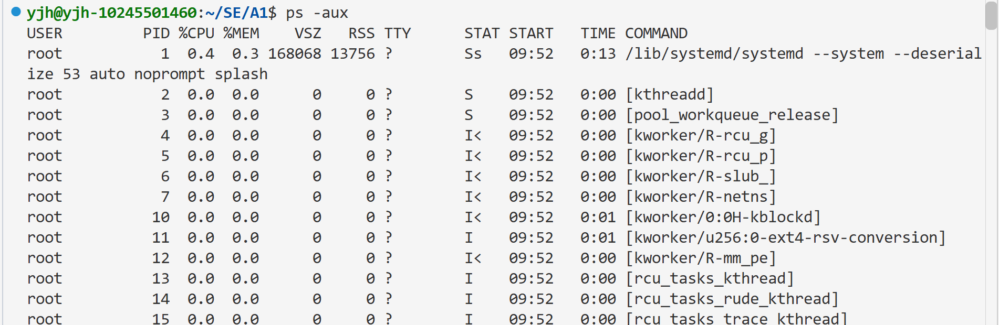
各列的含义分别为：

- USER：进程所属的有效用户。
- PID：进程编号。
- %CPU：进程累计 CPU 时间与自启动以来经过时间的比值，表示生命周期平均 CPU 利用率。
- %MEM：进程驻留内存 RSS 占物理内存总量的百分比。
- VSZ：虚拟地址空间大小，单位为 KiB，不等于实际占用的物理内存。
- RSS：当前驻留在物理内存中的大小，单位为 KiB。
- TTY：关联的控制终端，? 表示没有控制终端。
- STAT：进程状态；R 为运行或可运行，S 为可中断睡眠，D 为不可中断睡眠，T 为停止，Z 为僵尸，I 为内核空闲线程；附加的 s 表示会话首进程，l 表示多线程，+ 表示前台进程组，< 表示高优先级，N 表示低优先级。
- START：进程开始运行的时间或日期。
- TIME：进程累计使用的 CPU 时间，不是进程已经存在的总时间。
- COMMAND：启动命令及参数；部分内核线程以方括号表示。

### (9) `top` 与 `htop`

#### a. 以top为例，交互式界面的每一栏分别表示什么？
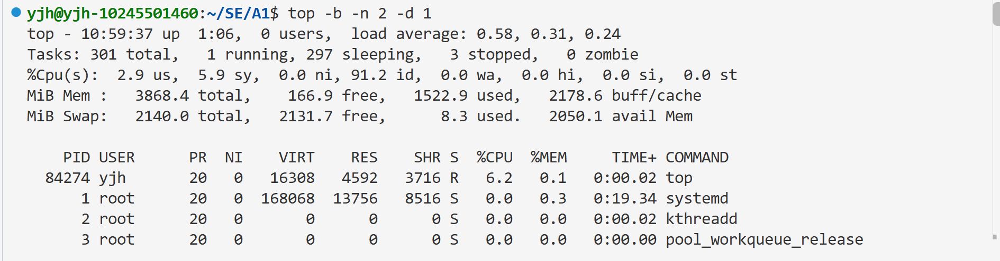
我们使用 `top -b -n 2 -d 1` 验证，-b 表示批处理模式，-n 2 表示显示两次，-d 1 表示两次刷新间隔 1 秒。htop 已在终端交互模式启动，并按 q 退出。  
第一栏 top：当前时间、系统运行时长、登录用户数，以及最近 1、5、15 分钟的平均负载。  
第二栏 Tasks：任务总数及 running、sleeping、stopped、zombie 数量，分别表示运行/可运行、睡眠、停止和僵尸状态。  
第三栏 %Cpu(s)：us 为普通用户态 CPU 时间，sy 为内核态，ni 为调整过 nice 值的用户态，id 为空闲，wa 为等待 I/O，hi 为硬中断处理，si 为软中断处理，st 为虚拟机被宿主机占用而未得到运行的时间。这里表示时间比例，不是各类进程数量。  
第四栏 MiB Mem：物理内存的 total、free、used 和 buff/cache。  
第五栏 MiB Swap：交换空间的 total、free、used，以及物理内存的 avail Mem。  
下面进程列表各列的含义为：

- PID、USER：进程编号和所属用户。
- PR、NI：调度优先级和 nice 值；nice 值越小，普通调度下优先程度通常越高。
- VIRT、RES、SHR：虚拟内存、驻留物理内存、驻留内存中可共享部分的大小；SHR 是 RES 的一部分。
- S：进程状态。
- %CPU：两次刷新之间进程使用 CPU 的比例；首次显示的统计区间可能不同。
- %MEM：驻留内存占总物理内存的比例。
- TIME+：累计使用的 CPU 时间，显示精度通常到百分之一秒。
- COMMAND：进程名或完整命令，可按 c 切换。

#### b. 简要比较两种工具的差别
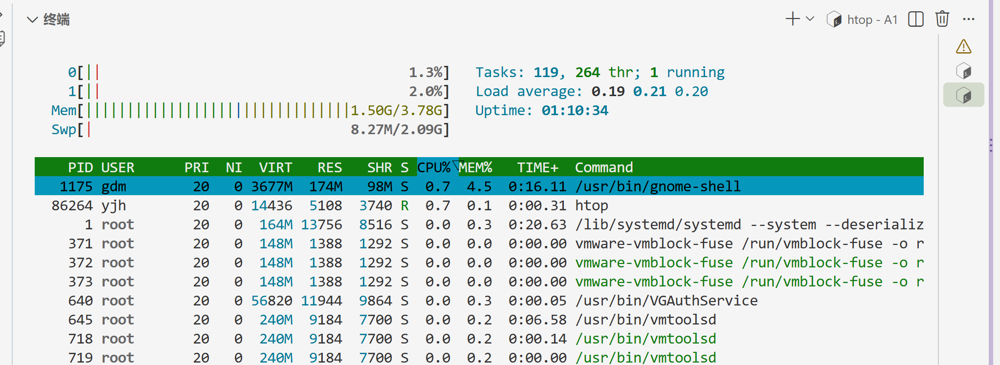
top 是常见的基础监控工具，通常系统自带，支持交互操作，也支持 -b 批处理输出，适合脚本采集。  
htop 默认以彩色进度条显示每个 CPU、内存和交换空间，支持鼠标、滚动、进程树，以及搜索、筛选和菜单式排序，查看进程间关系和操作进程更方便；通常需要另外安装。两者都可以按 q 退出，都属于持续刷新的系统监控工具。

### (10) `vmstat 1`
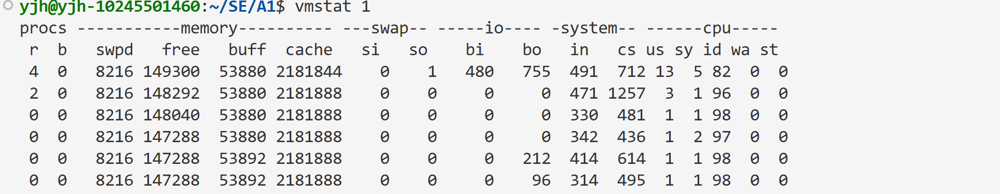
#### a. 参数1表示什么意思？
1 表示每隔 1 秒采样并输出一次，单位是秒，不是只执行一次。为便于终止验证，本次执行 vmstat 1 3，末尾的 3 表示输出 3 次。第一份报告中 CPU、I/O 等速率通常是自启动以来的平均值，后续报告才是对应采样间隔的值；进程和内存等字段显示采样时的状态。

#### b. 该命令统计哪些信息？

统计系统整体的进程、内存、交换、块设备 I/O、系统事件及 CPU 使用情况。  
procs 中 r 为可运行任务数，b 为阻塞等待 I/O 的任务数；memory 中 swpd 为已用交换空间，free 为空闲内存，buff 为缓冲区，cache 为缓存；swap 中 si、so 是换入、换出速率；io 中 bi、bo 是块设备输入、输出速率；system 中 in 为每秒中断数，cs 为每秒上下文切换数；cpu 中 us、sy、id、wa、st 分别表示用户态、内核态、空闲、等待 I/O 和被宿主机占用的时间比例。  
这里 memory 默认使用 KiB，si、so 默认使用 KiB/s，bi、bo 按该版本手册使用 KiB/s；cpu 各项单位为百分比。本次后两行中 si、so 都为 0，CPU 空闲比例为 97% 和 94%，说明这两个采样间隔没有发生交换，CPU 也较空闲。

### (11) `mpstat -P ALL 1`
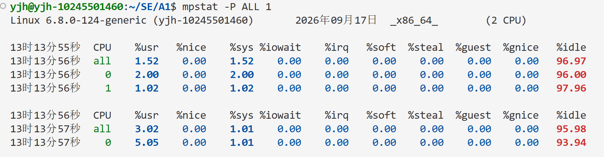
#### a. 参数1及 -P ALL 分别表示什么意思？

1 表示每隔 1 秒报告一次；-P ALL 表示显示每个在线逻辑 CPU 的统计数据，并显示 all 汇总行。
验证命令：`mpstat -P ALL 1`。

#### b. 该命令统计哪些信息？

统计各逻辑 CPU 的利用率，适合检查 CPU 之间的负载是否均衡。主要字段为 CPU 编号和 %usr、%nice、%sys、%iowait、%irq、%soft、%steal、%guest、%gnice、%idle，分别表示普通用户态、调整 nice 的用户态、内核态、等待 I/O、硬中断、软中断、虚拟化中被占用、运行虚拟 CPU、运行调整 nice 的虚拟 CPU及空闲时间比例。  
本机显示 all、0、1，表示 2 个在线逻辑 CPU；本次采样三个报告中的 %idle 都为 100.00，说明这个 1 秒区间内 CPU 基本空闲。all 是各 CPU 的综合平均比例，不是把每个 CPU 的百分比直接相加。

### (12) `pidstat 1`
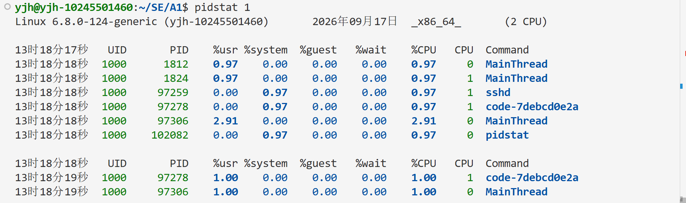
#### a. 参数1表示什么意思？

1代表的是时间间隔，表示每隔 1 秒采样一次
#### b. 该命令统计哪些信息？

pidstat 按进程统计资源使用情况，默认显示采样期间活跃任务的 CPU 数据。本次列出的 UID、PID 是用户编号和进程编号；%usr、%system、%guest 分别为用户态、内核态和运行虚拟 CPU 的时间比例；%wait 是任务等待被调度运行的时间比例，不等于 I/O 等待；%CPU 为 CPU 利用率，CPU 为运行时所在的逻辑 CPU 编号，Command 为进程名；Average 行为采样期间的平均值。  
本次采样中，系统有多个进程处于活跃状态。MainThread（PID 1812、1824、97306）的 %usr 在 0.97 到 2.91 之间，且 %system 和 %wait 几乎均为 0，说明其处于纯用户态计算状态；其中 PID 1812 和 97306 运行在逻辑 CPU 0 上，PID 1824 运行在 CPU 1 上，体现了多核并行。sshd（PID 97259）和 code-7debcd0e2a（PID 97278）的 %system 为 0.97，说明二者主要在消耗内核态时间。pidstat 自身（PID 102082）也出现在列表中，%CPU 为 0.97，主要用于本次数据采集。还可通过 -r 查看缺页和内存，-d 查看进程 I/O，-w 查看上下文切换，-t 查看线程，-p ALL 查看所有进程。

### (13) `iostat -xz 1`
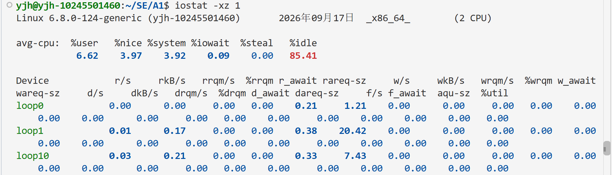
#### a. 参数1及 -x、-z 分别表示什么意思？
1 表示每隔 1 秒报告一次；-x 表示显示扩展设备统计；-z 表示省略在报告区间没有活动的设备。

#### b. 比较(10)—(13)分别统计哪些方面的信息

iostat 主要统计系统 CPU 汇总以及块设备 I/O。扩展设备字段中，r/s、w/s 是每秒完成的读写请求数；rkB/s、wkB/s 是读写吞吐量；rrqm/s、wrqm/s 是每秒合并的请求数；%rrqm、%wrqm 是合并比例；r_await、w_await 是读写请求平均完成时间，包含排队与服务时间，单位为毫秒；rareq-sz、wareq-sz 是平均请求大小；aqu-sz 为平均队列长度；%util 为设备存在 I/O 活动的时间比例。d 开头的字段对应 discard，f 开头的字段对应 flush。  
本次第二份报告只有 sda，读请求约 1.98 次/秒，读吞吐量约 75.25 KiB/s，r_await 为 0.50 ms，%util 为 0.10%，说明该间隔磁盘活动较少。对于 SSD、RAID 等可并行处理请求的设备，不能仅凭 %util 判断是否达到性能极限。  
四条命令的区别为：vmstat 从整个系统观察进程队列、内存、交换、I/O 和 CPU；mpstat 细分到每个逻辑 CPU；pidstat 细分到每个进程或线程；iostat 细分到每个块设备。
#### c. 比较 ps -aux 的 %CPU 和 pidstat、top、htop 中 CPU 利用率的区别

ps -aux 的 %CPU 是进程累计 CPU 时间除以进程存在的时间，表示自启动以来的平均值。例如进程运行了 100 秒，共使用 CPU 10 秒，则约为 10%；即使最近 1 秒占满 CPU，这个值也不会立即变成 100%。  
pidstat 指定采样间隔后，使用这个间隔内新增 CPU 时间计算利用率；top 和 htop 的进程 CPU 利用率通常按两次刷新之间的增量计算，因此更能反映最近的活动。首次刷新或未指定采样间隔时，统计区间可能不同。  
还要比较是否按 CPU 总数归一化：pidstat 默认按单个逻辑 CPU 的容量计量，-I 可以再除以 CPU 数量；top 默认 Irix 模式和 htop 常用的进程 CPU% 也以一个逻辑 CPU 的 100% 为基准，多线程进程可以超过 100%。top 可按 I 切换归一化方式；本机两个逻辑 CPU 都被一个进程占满时，按单 CPU 基准约为 200%，按整机容量归一化则约为 100%。mpstat 的 all 行是整机平均百分比，不能直接与单进程的未归一化值比较。

### (14) `sar -n DEV 1`
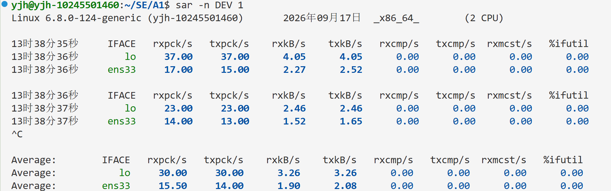
#### a. 参数1表示什么意思？

1 表示每隔 1 秒采样并报告一次网络设备统计

#### b. -n DEV 会获得哪些性能数据？

-n 表示报告网络统计，DEV 表示按网络接口统计。IFACE 是接口名；rxpck/s、txpck/s 是每秒接收、发送的包数；rxkB/s、txkB/s 是接收、发送的数据速率；rxcmp/s、txcmp/s 是每秒接收、发送的压缩包数；rxmcst/s 是每秒接收的多播包数；%ifutil 是接口利用率，依据流量、接口速率和双工模式计算。这里数据速率字段虽然写作 kB/s，该工具按 1024 字节换算。  
本次 lo 为回环接口，ens33 为虚拟网卡；ens33 的接收速率约 6.99 KiB/s、发送速率约 4.13 KiB/s，接口利用率约 0.01%，流量较低。Average 是本次采样的平均值。DEV 不直接给出网络错误和丢包详情，需要这些信息时可选择 -n EDEV。

### (15) `uptime`

#### ① 分析输出结果包含了哪些信息

输出结果：

```bash
yjh@yjh-10245501460:~/SE/A1$ uptime
 13:40:38 up  1:57,  0 users,  load average: 0.09, 0.09, 0.13
```

输出依次为：当前时间 13:40:38；系统已运行 1 小时 57 分钟；当前记录的登录用户数 0；最近 1、5、15 分钟的平均负载分别为 0.09、0.09、0.13。登录用户数来自登录会话记录，不等于正在运行进程的用户数量。
#### ② load average 的含义是什么？

load average 是可运行任务和不可中断等待任务数量的指数平滑平均值；可运行任务包括正在执行和等待 CPU 的任务，不可中断等待常见于 I/O。它不是 CPU 使用百分比，也不是三个区间内的简单算术平均。  
对于本机 2 个逻辑 CPU，如果负载主要来自 CPU 运算，平均负载接近 2 表示大致占满两个 CPU，持续高于 2 说明可能有任务排队；本次三个值都远小于 2，表示最近整体负载较低。但高负载也可能来自 I/O 等待，因此需要结合 CPU 利用率和 I/O 数据判断。

### (16) `$ cat /proc/interrupts 和 $ cat /proc/softirqs`
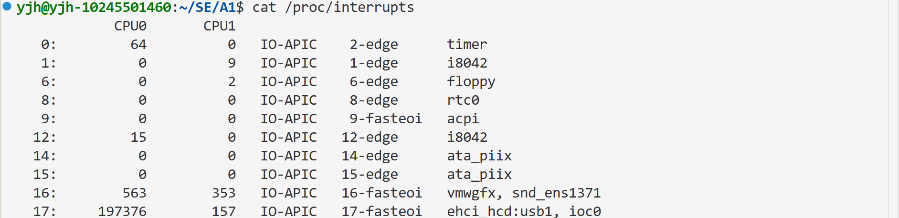
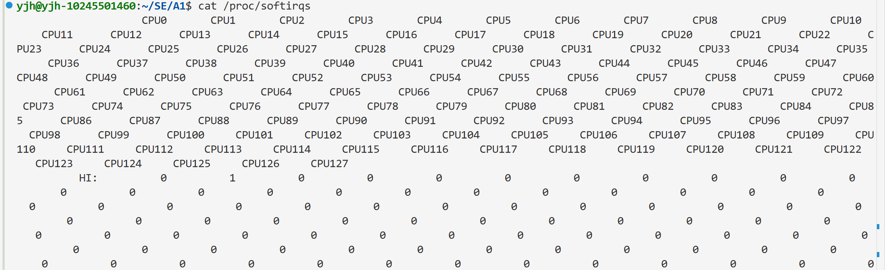
#### a. 分析输出结果包含了哪些信息
  
/proc/interrupts 按中断来源列出各 CPU 从启动以来的累计处理次数，还显示 IRQ 编号、中断控制器、中断触发类型和相关设备或处理程序；底部还有 LOC（本地定时器）、CAL（跨 CPU 函数调用）、RES（重新调度）等处理器内部中断统计。  
/proc/softirqs 按软中断类型列出各 CPU 的累计处理次数，包括 HI、TIMER、NET_TX、NET_RX、BLOCK、IRQ_POLL、TASKLET、SCHED、HRTIMER、RCU。软中断用于延后处理网络、块设备、定时器、调度和 RCU 等工作。统计的是处理次数，不能直接当作处理时间或每秒发生频率。  
本机只有 CPU0、CPU1 在线，但 /proc/softirqs 的表头还列出其他可能 CPU，其他列本次均为 0；0~127代表的是虚拟机支持的最大在线cpu数量为128.
#### b. 电脑上最频繁的硬中断/软中断是什么？简要分析其原因
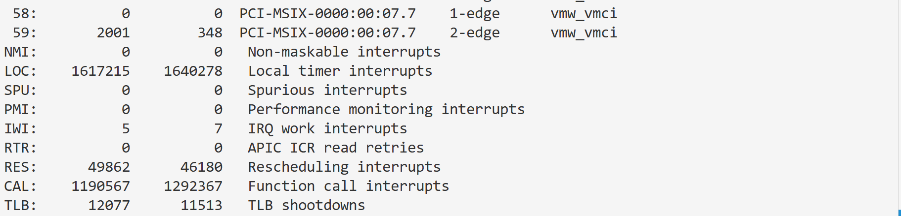  
硬中断及处理器内部中断中最多的是 LOC，本地定时器中断共 3257493 次；CAL 为 2482934 次。本地定时器用于调度和时间管理，会周期性或按定时事件触发；CAL 用于多核间的函数调用和协同，系统运行期间双核通信频繁，因此累计次数较多。  
若只比较带数字 IRQ 编号的设备硬中断，最多的是 IRQ 17，共 197533 次，对应 ehci_hcd:usb1、ioc0；该 IRQ 被 USB 控制器和存储控制器共享，因此不能只凭这行确定各设备贡献。本次有系统启动、软件包安装和文件读取，存储活动可能是较多中断的原因之一，这是根据工作负载作出的推测。其次是 IRQ 19（ens33 虚拟网卡），共 143479 次，反映了虚拟化环境下的网络通信活动。 
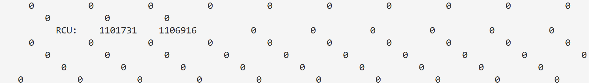
softirq 软中断最多的是 RCU，共 2208647 次，SCHED 为 953323 次。RCU 用于内核并发读访问及延后回收等机制，在系统运行中需要持续处理回调和相关工作；SCHED 用于进程调度和负载均衡，因此这两者在系统持续运转时都较为活跃。

### (17) `lstopo --of svg > topo.svg`

#### a. 简要分析 topo.svg 中展示的拓扑结构

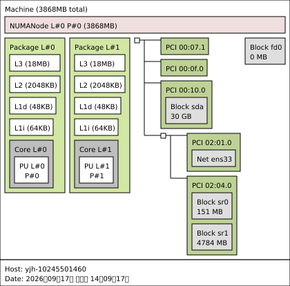

图中最外层 Machine 表示整台虚拟机，内存总量约 3868 MB；有 1 个 NUMA 节点（L#0 / P#0）和 2 个 Package（虚拟 CPU 插槽）。每个 Package 下各有一个 Core 和一个 PU，PU 表示可供系统调度的逻辑处理器，对应 CPU0、CPU1。  

每个 Package 的缓存层次为 L3 18 MiB、L2 2 MiB、L1d 48 KiB、L1i 64 KiB，向下连接核心和 PU；同一 Package 内的这些对象都只覆盖一个可见 PU。两个 Package 的 PU 都属于 NUMA 节点 0，并不是一个插槽对应一个 NUMA 节点。

I/O 部分显示 HostBridge、PCI/PCI 桥、VGA 图形设备、SCSI 控制器和 sda 磁盘、Ethernet 设备和 ens33 网卡、SATA 设备和 sr0、sr1 光驱等。L# 表示 hwloc 的逻辑编号，P# 表示操作系统提供的物理/系统编号。整体结构与 lscpu 的 2 插槽、2 核心、2 逻辑 CPU、1 个 NUMA 节点一致，反映的是 VMware 向虚拟机呈现的拓扑。
# A1: Getting Started
以下结果在 x86-64 Ubuntu 22.04 环境中完成。编译器使用 Clang 14；所有矩阵输出均来自实际运行。

## Write-up 2：`pointer.c`

1. `main` 的参数声明为 `int argc, char *argv[]`。在函数参数中数组会自动调整为指针，因此 `argv` 的实际类型是 `char **`。
2. `int *pi = &i` 取得 `i` 的地址，`*pi` 解引用后得到 `i` 的值，所以 `j` 为 5。
3. 数组 `char c[] = "6.172"` 在表达式中会退化为指向首元素的 `char *`，所以 `char *pc = c` 合法；`*pc` 是首字符，程序输出 `char d = 6`。
4. `argv` 的类型是 `char **`，所以 `pcp = argv` 类型匹配。`pcp` 指向一个 `char *`，而 `*pcp` 的类型是 `char *`。
5. `const char *pcc` 和 `char const *pcc2` 是同一种类型：指向 `const char` 的指针。指针本身可以修改，但不能通过它修改所指向的字符。因此 `*pcc = '7'` 非法；`pcc = *pcp` 和 `pcc = argv[0]` 合法，因为普通 `char *` 可以隐式转换为 `const char *`。
6. `char *const cp` 是“指向可修改字符的常量指针”。`cp = *pcp` 和 `cp = *argv` 都试图修改常量指针，非法；`*cp = '!'` 只修改所指向的字符，合法。
7. `const char *const cpc` 同时限定了指针和所指向的字符。`cpc = *pcp`、`cpc = argv[0]` 试图修改常量指针，`*cpc = '@'` 试图修改常量字符，三者均非法。

修改后的程序保留了上述非法语句的注释形式，因此可以正常编译；编译器仅报告未使用变量警告。

## Write-up 3：类型大小与指针大小

`sizes.c` 使用 `PRINT_TYPE_AND_POINTER` 宏同时打印每个类型和指向该类型的指针；数组使用 `sizeof(x)`，数组地址使用 `sizeof(&x)`。实际运行 `./sizes` 的完整输出如下：

```text
size of int : 4 bytes
size of int* : 8 bytes
size of short : 2 bytes
size of short* : 8 bytes
size of long : 8 bytes
size of long* : 8 bytes
size of char : 1 bytes
size of char* : 8 bytes
size of float : 4 bytes
size of float* : 8 bytes
size of double : 8 bytes
size of double* : 8 bytes
size of unsigned int : 4 bytes
size of unsigned int* : 8 bytes
size of long long : 8 bytes
size of long long* : 8 bytes
size of uint8_t : 1 bytes
size of uint8_t* : 8 bytes
size of uint16_t : 2 bytes
size of uint16_t* : 8 bytes
size of uint32_t : 4 bytes
size of uint32_t* : 8 bytes
size of uint64_t : 8 bytes
size of uint64_t* : 8 bytes
size of uint_fast8_t : 1 bytes
size of uint_fast8_t* : 8 bytes
size of uint_fast16_t : 8 bytes
size of uint_fast16_t* : 8 bytes
size of uintmax_t : 8 bytes
size of uintmax_t* : 8 bytes
size of intmax_t : 8 bytes
size of intmax_t* : 8 bytes
size of __int128 : 16 bytes
size of __int128* : 8 bytes
size of x : 20 bytes
size of &x : 8 bytes
size of student : 8 bytes
size of student* : 8 bytes
```

在 64 位平台上，指针本身保存地址，大小统一为 8 bytes；它不会随所指向对象的类型大小改变。`uint_fast16_t` 在本平台为 8 bytes，说明 `uint_fast` 类型只保证至少达到指定宽度，并选择本平台上较快的实现类型。

## Write-up 4：用指针实现 `swap`

C 的普通参数按值传递，原来的 `swap(int i, int j)` 只交换了函数内部的两个副本。修改后通过指针访问调用者的变量：

```c
void swap(int *i, int *j) {
  int temp = *i;
  *i = *j;
  *j = temp;
}

int main(void) {
  int k = 1;
  int m = 2;
  swap(&k, &m);
  printf("k = %d, m = %d\n", k, m);
  return 0;
}
```

运行 `./swap` 输出：

```text
k = 2, m = 1
```

`python3 verifier.py` 对 `sizes`、`pointer` 和 `swap` 均检查通过，最后输出 `LGTM`。

## Write-up 5：`-O3` 构建结果

已将 `matrix-multiply/Makefile` 的发布配置从 `-O1 -DNDEBUG` 改为 `-O3 -DNDEBUG`。执行 `make clean; make` 时会删除旧的目标文件、二进制和 `.buildmode`，然后以 `-O3` 重新编译并链接：

```text
rm -f testbed.o matrix_multiply.o matrix_multiply .buildmode ...
clang -O3 -DNDEBUG -Wall -std=c99 -D_POSIX_C_SOURCE=200809L -c testbed.c -o testbed.o
clang -O3 -DNDEBUG -Wall -std=c99 -D_POSIX_C_SOURCE=200809L -c matrix_multiply.c -o matrix_multiply.o
clang -o matrix_multiply testbed.o matrix_multiply.o -lrt -flto -fuse-ld=gold
```

因此 `make` 本身没有额外的运行时输出；变化体现在编译命令中的优化级别和生成的机器码。原始测试程序中 `A` 被错误地创建为 4×5、`B` 为 4×4，直接运行会在矩阵乘法循环中发生段错误。通过后续断言定位并修复为兼容的 4×4 矩阵后，程序可以正常完成。

## Write-up 6：AddressSanitizer

在保留原始维度错误（`A` 为 4×5、`B` 为 4×4）时，执行 `make clean && make ASAN=1`，再运行 `./matrix_multiply`，AddressSanitizer 报告了越界访问。输出的核心部分如下：

```text
Setup
Running matrix_multiply_run()...
=================================================================
==16==ERROR: AddressSanitizer: heap-buffer-overflow on address 0x603000000150
READ of size 8 at 0x603000000150 thread T0
    #0 ... in matrix_multiply_run
    #1 ... in main
0x603000000150 is located 0 bytes to the right of 32-byte region
[0x603000000130,0x603000000150)
allocated by thread T0 here:
    #0 ... in malloc
    #1 ... in make_matrix
    #2 ... in main

SUMMARY: AddressSanitizer: heap-buffer-overflow in matrix_multiply_run
==16==ABORTING
```

该报告说明循环访问了 `B->values[4]`，而 `B` 只有 4 行；根因是矩阵维度不满足 `A->cols == B->rows`。我将 `A` 改为 4×4，并保留调试构建中的 `tbassert` 检查，避免这类错误再次退化为无提示的段错误。

## Write-up 7：修复未初始化矩阵后的输出

`make_matrix` 中的每一行改用 `calloc`，使 `C` 在累加乘积前全部为 0；同时修复了矩阵维度。执行 `./matrix_multiply -p` 的输出如下：

```text
Setup
Running matrix_multiply_run()...
Matrix A: 
------------
    3      7      8      1  
    7      9      8      3  
    1      2      6      7  
    9      8      1      9  
------------
Matrix B: 
------------
    1      3      0      1  
    5      5      7      8  
    0      1      9      8  
    9      3      1      7  
------------
---- RESULTS ----
Result: 
------------
   47     55    122    130  
   79     83    138    164  
   74     40     75    114  
  130     95     74    144  
------------
---- END RESULTS ----
Elapsed execution time: 0.000000 sec
```

结果矩阵与逐项计算的 `A×B` 一致；例如第一行第一列为 `3×1 + 7×5 + 8×0 + 1×9 = 47`。

## Write-up 8：Valgrind 无错误输出

最后在正常的 `-O3` 构建上执行 `valgrind --leak-check=full ./matrix_multiply -p`。在 `testbed.c` 末尾释放 `A`、`B`、`C`，并使用 `calloc` 初始化矩阵后，Valgrind 的摘要为：

```text
==18== HEAP SUMMARY:
==18==     in use at exit: 0 bytes in 0 blocks
==18==   total heap usage: 19 allocs, 19 frees, 4,432 bytes allocated
==18== All heap blocks were freed -- no leaks are possible
==18== ERROR SUMMARY: 0 errors from 0 contexts (suppressed: 0 from 0)
```

这表明矩阵及其行数组均已释放，没有内存泄漏、未初始化值使用或其他 Memcheck 错误。
